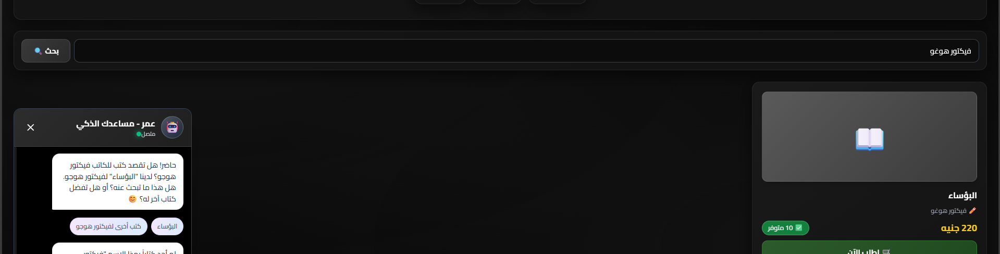

# 📚 Book.com - E-Commerce Bookstore Platform

> A sophisticated Arabic-language bookstore platform with an AI-powered intelligent assistant


## 🌟 Overview
---

 
  
  
  
  
  

**Book.com** is a modern, full-featured e-commerce platform designed specifically for Arabic-speaking users to browse and purchase books online. The platform features a stunning user interface, an AI-powered chatbot named "Omar" built with Google Gemini AI, and a comprehensive admin dashboard for inventory management.

### ✨ Key Features

- 🤖 **AI Assistant (Omar)**: Powered by Google Gemini AI for natural customer interactions
- 🛒 **Advanced Order System**: Support for multiple books per order with automatic processing
- 🔍 **Smart Search**: Flexible search with fuzzy matching for typo tolerance
- 💳 **Automated Order Processing**: Automatic inventory updates upon order completion
- 🎨 **Modern Design**: Glassmorphism UI with engaging animations and effects
- 📊 **Admin Dashboard**: Complete inventory and order management system
- 📱 **Responsive Design**: Seamless experience across all devices
- 🔔 **Real-time Notifications**: Elegant toast notification system

---

## 📋 Table of Contents

- [Installation](#-installation)
- [Configuration](#-configuration)
- [Usage](#-usage)
- [Technical Architecture](#-technical-architecture)
- [API Reference](#-api-reference)
- [Customization](#-customization)
- [Troubleshooting](#-troubleshooting)
- [Deployment](#-deployment)
- [Contributing](#-contributing)
- [License](#-license)

---

## 🚀 Installation

### Prerequisites

- Modern web browser (Chrome, Firefox, Safari, Edge)
- Internet connection
- Google Cloud account with Gemini API access
- SheetDB account for cloud storage

### Installation Steps

1. **Clone the Repository**
```bash
git clone https://github.com/Ahm3d0x/book-com.git
cd book-com
```

2. **Project Structure**
```
book-com/
│
├── index.html          # Main page
├── index.js            # Core application logic
├── style.css           # Styles and animations
└── README.md           # Documentation
```

3. **No Dependencies Required** - The project runs directly in the browser!

---

## ⚙️ Configuration

### 1. Gemini API Setup

1. Navigate to [Google AI Studio](https://makersuite.google.com/app/apikey)
2. Create a new API key
3. Open `index.js` and replace the key:

```javascript
const GEMINI_API_KEY = 'YOUR_GEMINI_API_KEY_HERE';
```

### 2. SheetDB Configuration

#### Create Google Sheets Database

Create a new Google Sheet with the following tabs:

**Sheet: المخزون (Inventory)**
| اسم الكتاب (Book Name) | المؤلف (Author) | السعر (Price) | الكمية (Quantity) |
|------------------------|----------------|--------------|------------------|
| Example Book           | Author Name    | 100          | 50               |

**Sheet: الطلبات (Orders)**
| تاريخ الطلب (Date) | اسم العميل (Name) | رقم الهاتف (Phone) | العنوان (Address) | الكتب المطلوبة (Books) | الإجمالي (Total) | الحالة (Status) |
|-------------------|------------------|-------------------|------------------|----------------------|-----------------|----------------|

#### Connect SheetDB

1. Sign up at [SheetDB.io](https://sheetdb.io/)
2. Create a new API and link it to your Google Sheet
3. Get your API URL
4. Replace in `index.js`:

```javascript
const INVENTORY_API_URL = 'YOUR_SHEETDB_API_URL';
const ORDERS_API_URL = 'YOUR_SHEETDB_API_URL';
```

### 3. Admin Credentials Setup

Default credentials:
- **Username**: `admin`
- **Password**: `admin123`

To change, edit in `index.js`:

```javascript
const ADMIN_USERNAME = 'your_username';
const ADMIN_PASSWORD = 'your_password';
```

---

## 💻 Usage

### Running the Project

1. Open `index.html` in your browser, or
2. Use a local server:

```bash
# Using Python
python -m http.server 8000

# Using Node.js
npx http-server

# Using PHP
php -S localhost:8000
```

3. Navigate to `http://localhost:8000`

### Using the AI Assistant "Omar"

1. Click the chat button 💬 in the bottom corner
2. Ask questions or request books like:
   - "I want a programming book"
   - "Search for books by Mohamed Salah"
   - "Recommend history books"
   - "I want to buy 3 copies of The Red Book"

### Completing Orders

1. Tell Omar which books you want
2. He'll add them to your order and show a summary
3. Click "Complete Order"
4. Enter your details (name, phone, address)
5. Order will be automatically recorded

### Admin Dashboard

1. Click "🔐 Control Panel" at the top
2. Log in with default credentials
3. You can:
   - ➕ Add new books
   - ✏️ Edit quantities
   - 🗑️ Delete books
   - 📊 Monitor inventory

---

## 🏗️ Technical Architecture

### Tech Stack

| Technology | Purpose | Version |
|-----------|---------|---------|
| HTML5 | Structure | - |
| CSS3 | Styling | - |
| JavaScript (Vanilla) | Application Logic | ES6+ |
| Tailwind CSS | CSS Framework | CDN |
| Google Gemini AI | AI Assistant | 2.0 Flash |
| SheetDB API | Database | v1 |
| Google Fonts | Arabic Typography | Cairo |

### System Architecture

```
┌─────────────────────────────────────────┐
│           User Interface (UI)           │
│  ┌───────────┐  ┌───────────────────┐  │
│  │  Main Page│  │  Admin Dashboard  │  │
│  └─────┬─────┘  └─────────┬─────────┘  │
│        │                  │             │
│  ┌─────▼──────────────────▼─────────┐  │
│  │    Chat Widget (Omar - AI)       │  │
│  └──────────────┬───────────────────┘  │
└─────────────────┼───────────────────────┘
                  │
        ┌─────────▼──────────┐
        │   Core Logic (JS)  │
        │  ┌──────────────┐  │
        │  │ State Mgmt   │  │
        │  ├──────────────┤  │
        │  │ API Handler  │  │
        │  ├──────────────┤  │
        │  │ AI Processor │  │
        │  └──────────────┘  │
        └─────────┬──────────┘
                  │
      ┌───────────┴───────────┐
      │                       │
┌─────▼──────┐       ┌────────▼────────┐
│ Gemini API │       │  SheetDB API    │
│  (AI Bot)  │       │  (Database)     │
└────────────┘       └─────────────────┘
```

### File Structure

#### `index.html` - Main Interface
- Navigation Bar
- Hero Section
- Search Bar
- Books Grid
- Chat Widget
- Admin Panel
- Modals & Notifications

#### `index.js` - Application Logic
```javascript
// Main sections:
├── Configuration (APIs & Credentials)
├── State Management
├── UI Components (Modals, Notifications)
├── Books Management
├── AI Chatbot (Gemini Integration)
├── Order Processing
└── Admin Panel Functions
```

#### `style.css` - Styling
- Glassmorphism Effects
- Animations & Transitions
- Responsive Design
- Custom Scrollbars
- Status Indicators

---

## 📚 API Reference

### Gemini AI Integration

```javascript
// Send message to AI assistant
async function getGeminiResponse(userMessage) {
  const response = await fetch(GEMINI_API_URL, {
    method: 'POST',
    headers: { 'Content-Type': 'application/json' },
    body: JSON.stringify({
      contents: [{ parts: [{ text: fullPrompt }] }],
      generationConfig: { 
        temperature: 0.7, 
        maxOutputTokens: 1000 
      }
    })
  });
  // Process response...
}
```

### SheetDB Operations

#### Read Data
```javascript
// Fetch all books
const response = await fetch(`${INVENTORY_API_URL}?sheet=المخزون`);
const books = await response.json();
```

#### Create Data
```javascript
// Add new book
await fetch(`${INVENTORY_API_URL}?sheet=المخزون`, {
  method: 'POST',
  headers: { 'Content-Type': 'application/json' },
  body: JSON.stringify({
    'اسم الكتاب': 'Book Title',
    'المؤلف': 'Author Name',
    'السعر': '100',
    'الكمية': '50'
  })
});
```

#### Update Data
```javascript
// Update book quantity
await fetch(`${INVENTORY_API_URL}/اسم الكتاب/${bookName}?sheet=المخزون`, {
  method: 'PATCH',
  headers: { 'Content-Type': 'application/json' },
  body: JSON.stringify({ الكمية: newQuantity })
});
```

#### Delete Data
```javascript
// Delete book
await fetch(`${INVENTORY_API_URL}/اسم الكتاب/${bookName}?sheet=المخزون`, {
  method: 'DELETE'
});
```

---

## 🎯 Core Functions

### 1. Smart Search

```javascript
async function findBook(bookName, fuzzySearch = true) {
  // Exact search
  let foundBooks = allBooks.filter(book => 
    book['اسم الكتاب'].toLowerCase().includes(bookName.toLowerCase())
  );
  
  // Fuzzy search (if no results)
  if (foundBooks.length === 0 && fuzzySearch) {
    const searchTerms = bookName.split(' ');
    foundBooks = allBooks.filter(book => {
      const bookTitle = book['اسم الكتاب'].toLowerCase();
      return searchTerms.some(term => 
        bookTitle.includes(term.toLowerCase())
      );
    });
  }
  
  return foundBooks;
}
```

### 2. Order Processing

```javascript
async function handleOrderProcess(message) {
  switch (conversationState) {
    case 'ordering_name':
      orderDetails.name = message;
      conversationState = 'ordering_phone';
      break;
    case 'ordering_phone':
      orderDetails.phone = message;
      conversationState = 'ordering_address';
      break;
    case 'ordering_address':
      orderDetails.address = message;
      await finalizeOrder();
      break;
  }
}
```

### 3. Smart Recommendations

```javascript
async function recommendBook(category) {
  let availableBooks = allBooks.filter(book => 
    parseInt(book.الكمية) > 0
  );
  
  if (category) {
    availableBooks = availableBooks.filter(book => 
      book['اسم الكتاب'].toLowerCase().includes(category.toLowerCase())
    );
  }
  
  const randomBooks = availableBooks
    .sort(() => 0.5 - Math.random())
    .slice(0, 3);
    
  return randomBooks;
}
```

---

## 🎨 Customization

### Changing Colors

In `style.css`:
```css
/* Primary colors */
body { 
  background: linear-gradient(135deg, #1e3a8a 0%, #581c87 100%); 
}

/* Button colors */
.bg-gradient-to-r {
  --tw-gradient-from: #2563eb;  /* Blue */
  --tw-gradient-to: #7c3aed;    /* Purple */
}
```

### Customizing AI Personality

In `index.js`:
```javascript
const ENHANCED_SYSTEM_PROMPT = `
You are "Omar", a professional and creative AI assistant for Book.com in Egypt.
Your personality is characterized by:
- [Add desired traits]
- [Define response style]
- [Set formality level]
`;
```

### Adding New Features

```javascript
// Example: Add rating system
function addRatingSystem() {
  // Add your code here
}

// Example: Add coupon system
function applyCoupon(code) {
  // Add your code here
}
```

---

## 🐛 Troubleshooting

### Common Issues and Solutions

#### 1. AI Assistant Not Responding

**Cause**: Invalid or expired API key

**Solution**:
```javascript
// Verify API key in index.js
console.log('API Key:', GEMINI_API_KEY);
```

#### 2. Orders Not Being Saved

**Cause**: SheetDB API issue

**Solution**:
- Verify API URL is correct
- Ensure sheet names match
- Check Google Sheet permissions

#### 3. Books Not Displaying

**Cause**: Data structure error

**Solution**:
```javascript
// Check data in Console
console.log('Books Data:', allBooks);
```

#### 4. CORS Errors

**Solution**:
- Use a local server instead of opening the file directly
- Verify SheetDB API settings

---

## 🚀 Deployment

### Deployment Options

#### 1. GitHub Pages
```bash
# Create gh-pages branch
git checkout -b gh-pages
git add .
git commit -m "Deploy to GitHub Pages"
git push origin gh-pages
```

#### 2. Netlify
1. Push project to GitHub
2. Connect Netlify to repository
3. Deploy automatically

#### 3. Vercel
```bash
npm i -g vercel
vercel
```

#### 4. Traditional Hosting
- Upload files via FTP
- Ensure HTTPS support

---

## 🤝 Contributing

Contributions are welcome! Here's how to contribute:

### Contribution Steps

1. **Fork the project**
2. **Create a feature branch**
```bash
git checkout -b feature/amazing-feature
```

3. **Commit your changes**
```bash
git commit -m 'Add amazing feature'
```

4. **Push to the branch**
```bash
git push origin feature/amazing-feature
```

5. **Open a Pull Request**

### Contribution Guidelines

- Follow existing code style
- Write clear comments (Arabic preferred for this project)
- Test changes before submitting
- Document new features

---

## 📝 License

This project is licensed under the MIT License - see the [LICENSE](LICENSE) file for details.

```
MIT License

Copyright (c) 2024 Book.com

Permission is hereby granted, free of charge, to any person obtaining a copy
of this software and associated documentation files (the "Software"), to deal
in the Software without restriction, including without limitation the rights
to use, copy, modify, merge, publish, distribute, sublicense, and/or sell
copies of the Software.
```

---

## 👥 Team

- **Lead Developer**: [Your Name]
- **Design**: [Designer Name]
- **Technical Support**: support@bookcom.example

---

## 📧 Contact

- **Website**: [https://bookcom.example](https://bookcom.example)
- **Email**: info@bookcom.example
- **Twitter**: [@BookComEG](https://twitter.com/bookcomeg)
- **Facebook**: [Book.com](https://facebook.com/bookcom)

---

## 🙏 Acknowledgments

- [Google Gemini AI](https://ai.google.dev/) - AI Assistant
- [SheetDB](https://sheetdb.io/) - Database Solution
- [Tailwind CSS](https://tailwindcss.com/) - CSS Framework
- [Google Fonts](https://fonts.google.com/) - Cairo Font

---

## 📚 Additional Resources

- [Gemini API Guide](https://ai.google.dev/docs)
- [SheetDB Documentation](https://docs.sheetdb.io/)
- [Tailwind CSS Guide](https://tailwindcss.com/docs)
- [Examples & Code](https://github.com/your-repo/examples)

---

## 🎓 Education
- **Name:** Ahmed Mohamed Attia  
- **University:** Zagazig University – Faculty of Engineering  
- **Specialization:** Communications & Electronics Engineering  
- **Year:** Going into 2nd year  

---

## 🌐 Find Me Online
- 📂 GitHub: [Ahm3d0x](https://github.com/Ahm3d0x)  
- 💼 LinkedIn: [Ahmed M. Attia](https://linkedin.com/in/ahmed-m-attia-757aa6292)  
- 📧 Email: [ahm3d.m.attia@gmail.com](mailto:ahm3d.m.attia@gmail.com)  

---

## 🤝 Contribution & Feedback
Feel free to check the design files, suggest improvements, or fork this repository!  
I’d love to hear your feedback and ideas 🌟.  

---

## 📜 License
This project is released under the **MIT License** – free to use, modify, and share.

---

<div align="center">

**Made with ❤️ in Egypt**

[🔝 Back to Top](#-bookcom---e-commerce-bookstore-platform)

</div>


